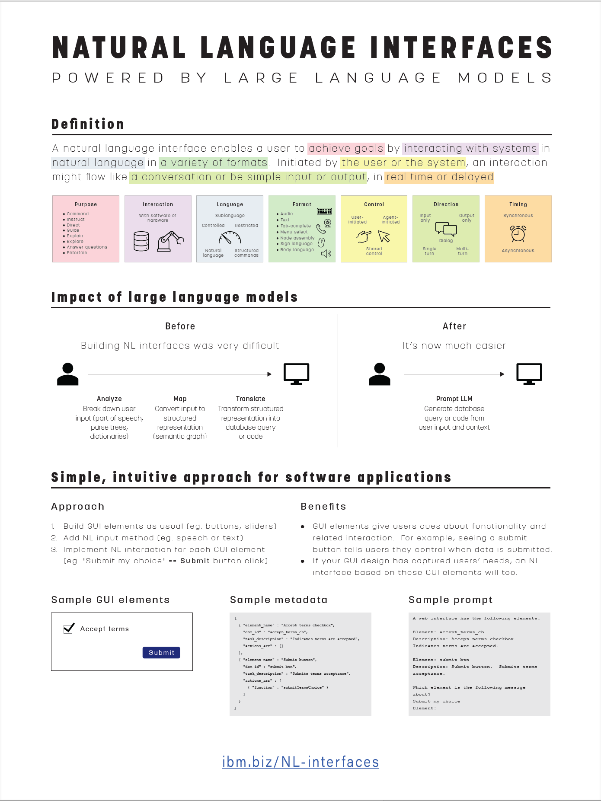
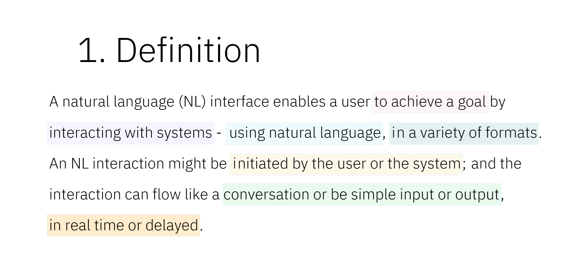
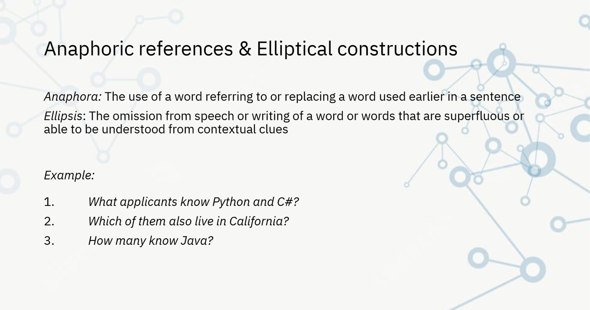
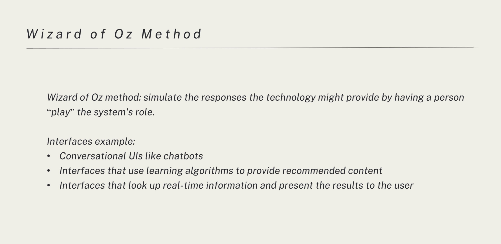
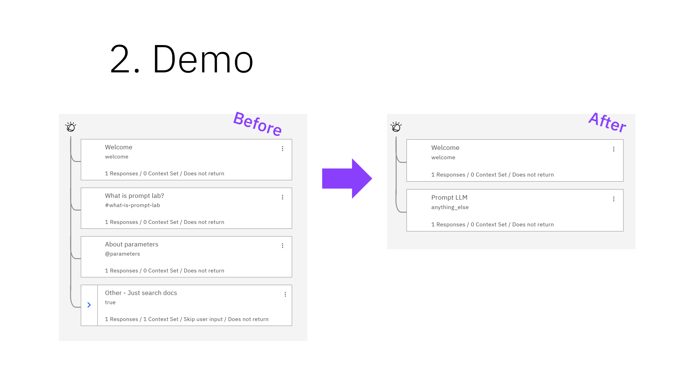
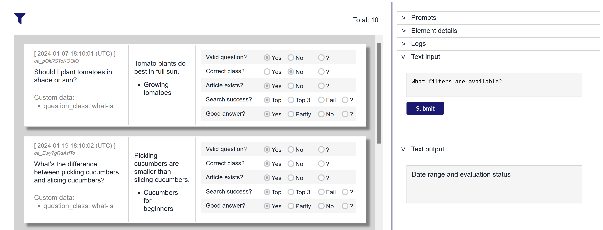
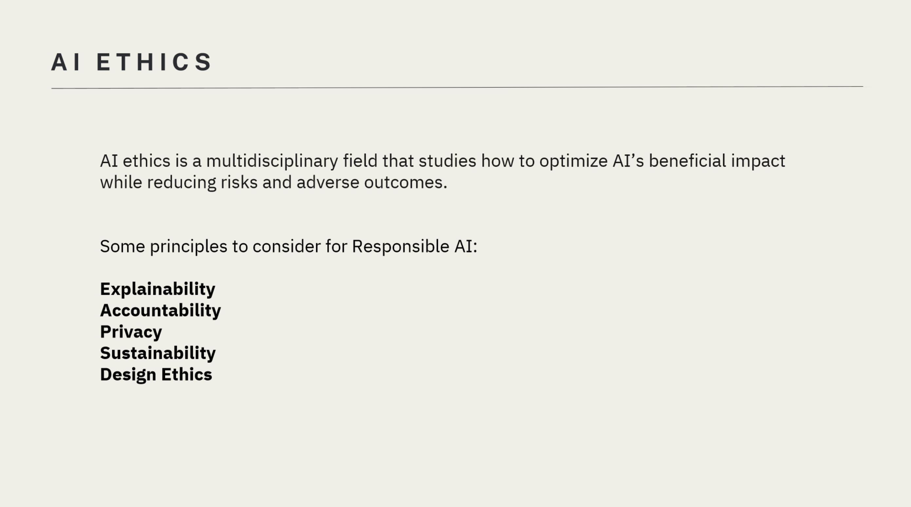
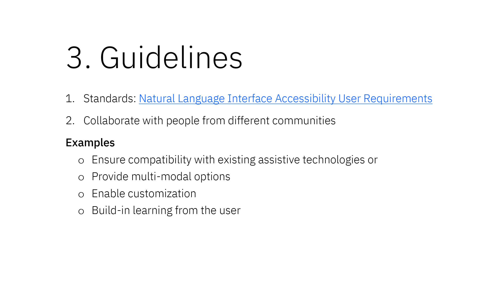
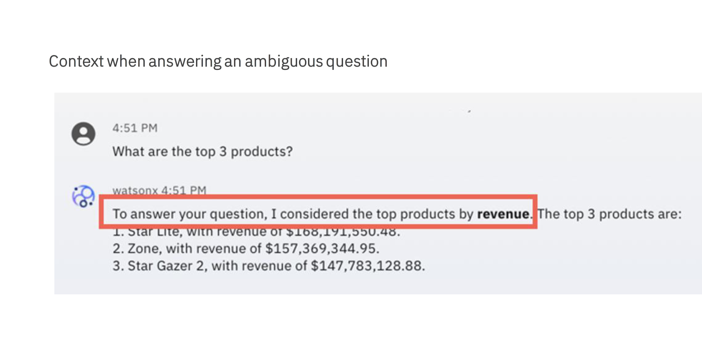
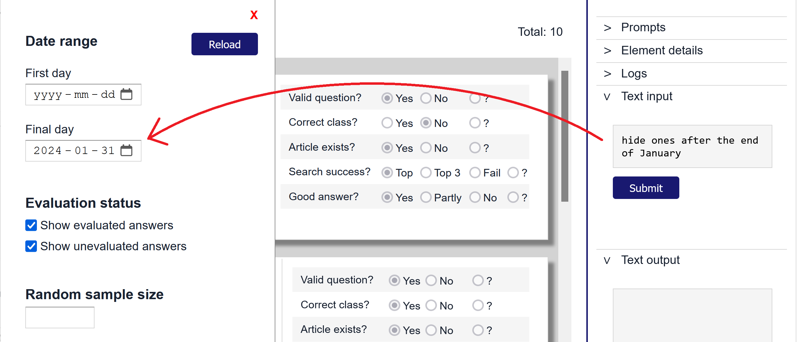

# Natural language interfaces powered by large language models
Supporting material for a poster and workshop, at CASCON 2024, all about using large language models (LLMs) to build natural language (NL) interfaces.

Presenters:
- Ashley Zhao ( <mailto>Ashley.Zhao@ibm.com</mailto> )
- Kelly Xiang ( <mailto>Kelly.Xiang@ibm.com</mailto> )
- Sara Elsharawy ( <mailto>saraelsh@ibm.com</mailto> )
- Ruby Bagga ( <mailto>ruby.bagga@ibm.com</mailto> )
- Sarah Packowski ( <mailto>spackows@ca.ibm.com</mailto> )

&nbsp;

## Introduction
NL interfaces have been around for more than 50 years!  

What's new is how LLMs - and retrieval-augmented generation (RAG) in particular - make implementing NL interfaces much easier.

In this hands-on workshop series, participants will learn the basics of NL interfaces and use a web app to prototype NL interface features.

&nbsp;

## Poster
This poster defines the breadth of NL interfaces, explains how LLMs make it much easier to building NL interfaces, and proposes a simple-to-build, intuitive-for-users approach to creating NL interfaces for software applications.

Download: [Poster](poster/NL-interfaces-CASCON-2024.pdf)

&nbsp;

## Workshop agenda
<table>
<tr>
<th>Time</th>
<th>Section</th>
<th>Details</th>
</tr>
<tr><!------------------------------- 01 ----------------------------------->
<td valign="top">1:30</td>
<td valign="top">

<b>Introduction&nbsp;to&nbsp;NL&nbsp;interfaces</b>

</td>
<td valign="top">

This introduction frames our discussion of NL interfaces:

<ul>
<li>Definition: what is an NL interface?</li>
<li>Motivation: why bother with NL interfaces?</li>
<li>Brief history of the study of NL interfaces</li>
</ul>

Download: <a href="slides/01_intro.pdf">Slides</a>

</td>
</tr>
<tr><!------------------------------- 02 ----------------------------------->
<td valign="top">1:50</td>
<td valign="top">

<b>Challenges&nbsp;of&nbsp;building&nbsp;NL&nbsp;interfaces</b>

</td>
<td valign="top">

If researchers have been studying NL interfaces for so long, why aren't there NL interfaces everywhere?  Why have NL interfaces been so difficult to build?

Download: <a href="slides/02_challenges.pdf">Slides</a>

</td>
</tr>
<tr><!------------------------------- 03 ----------------------------------->
<td valign="top">2:05</td>
<td valign="top">

<b>User&nbsp;research&nbsp;experience</b>

</td>
<td valign="top">

This is what we learned when we sat down with some users to see how they really used natural language to interact with a software application.

Download: <a href="slides/03_user-research.pdf">Slides</a>

</td>
</tr>
<tr><!------------------------------- 04 ----------------------------------->
<td valign="top">2:20</td>
<td valign="top">

<b>How&nbsp;LLMs&nbsp;simplify&nbsp;building&nbsp;NL&nbsp;interfaces</b>

</td>
<td valign="top">

In the past, multiple, complex natural language processing techniques were needed to analyze user input, map it to to a structured representation, and then translate that structured representation to something a machine could execute.

Now, an LLM can translate user input directly to something a machine can execute.

Download: <a href="slides/04_llms-simplify.pdf">Slides</a>

</td>
</tr>
<tr><!------------------------------- 05 ----------------------------------->
<td valign="top">2:30</td>
<td valign="top">

<b>Hands-on&nbsp;1:&nbsp;NL&nbsp;prototyping&nbsp;tool</b>

</td>
<td valign="top">

In this exercise, we'll introduce the NL interface prototyping tool:

<ol>
<li>How to classify user input as a question or an instruction</li>
<li>How application information is saved in a JSON structure</li>
<li>How that application information is provided as context in LLM prompts</li>
<li>Answering user questions (contextual help)</li>
</ol>

Download: <a href="slides/05_exercise-01.pdf">Slides</a>

</td>
</tr>
<tr><!----------------------------- break ---------------------------------->
<td valign="top">3:00</td>
<td valign="top">

BREAK

</td>
<td valign="top">

~ ~ ~ ~ ~ ~ ~ ~ ~ ~ ~ ~ ~ ~ ~ ~ 

</td>
</tr>
<tr><!------------------------------- 06 ----------------------------------->
<td valign="top">3:20</td>
<td valign="top">

<b>Ethics&nbsp;of&nbsp;NL&nbsp;interfaces</b>

</td>
<td valign="top">

Download: <a href="slides/06_ethics.pdf">Slides</a>

</td>
</tr>
<tr><!------------------------------- 07 ----------------------------------->
<td valign="top">3:35</td>
<td valign="top">

<b>NL&nbsp;interfaces&nbsp;accessibility</b>

</td>
<td valign="top">

Download: <a href="slides/07_accessibility.pdf">Slides</a>

</td>
</tr>
<tr><!------------------------------- 08 ----------------------------------->
<td valign="top">3:45</td>
<td valign="top">

<b>Choosing&nbsp;a&nbsp;pain&nbsp;point&nbsp;to&nbsp;solve&nbsp;with&nbsp;NL&nbsp;features</b>

</td>
<td valign="top">

Download: <a href="slides/08_choosing-pain-point.pdf">Slides</a>

</td>
</tr>
<tr><!------------------------------- 09 ----------------------------------->
<td valign="top">4:00</td>
<td valign="top">

<b>Real&nbsp;world&nbsp;experience&nbsp;building&nbsp;NL&nbsp;features</b>

</td>
<td valign="top">

Download: <a href="slides/09_experience.pdf">Slides</a>

</td>
</tr>
<tr><!------------------------------- 10 ----------------------------------->
<td valign="top">4:20</td>
<td valign="top">

<b>Hands-on&nbsp;2:&nbsp;Prototyping&nbsp;NL&nbsp;features</b>

</td>
<td valign="top">

Download: <a href="slides/10_exercise-02.pdf">Slides</a>

</td>
</tr>
</table>
