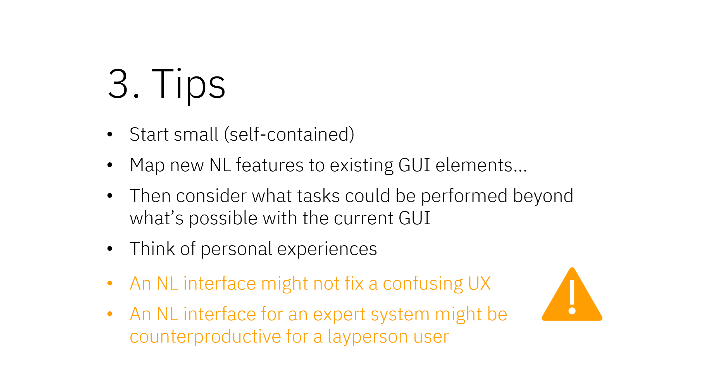

# Natural language interfaces powered by large language models
Supporting material for a poster and workshop, at [CASCON](https://cascon.ca) 2024, all about using large language models (LLMs) to build natural language (NL) interfaces.

Presenters:
- Ruby Bagga ( <mailto>ruby.bagga@ibm.com</mailto> )
- Sara Elsharawy ( <mailto>saraelsh@ibm.com</mailto> )
- Sarah Packowski ( <mailto>spackows@ca.ibm.com</mailto> )
- Kelly Xiang ( <mailto>Kelly.Xiang@ibm.com</mailto> )
- Ashley Zhao ( <mailto>Ashley.Zhao@ibm.com</mailto> )

&nbsp;

## Introduction
NL interfaces have been around for more than 50 years!  

What's new is how LLMs - and retrieval-augmented generation (RAG), in particular - make implementing NL interfaces much easier.

In this hands-on workshop series, participants learn the basics of NL interfaces and use a web app* to prototype NL interface features.

\* The NL interface prototyping tool used in this workshop is powered by: [IBM watsonx.ai](watsonx.ai)

&nbsp;

## Poster
This poster defines the breadth of NL interfaces, explains how LLMs make it much easier to build NL interfaces, and proposes a simple-to-build, intuitive-for-users approach to creating NL interfaces for software applications.

Download: [Poster](poster/NL-interfaces-CASCON-2024.pdf)

&nbsp;

## Workshop
**Date:** Wednesday, November 13th, 2024 
**Time:** 1:30pm 
**Room:** D2

_*Participants should bring a laptop to access the NL interface prototyping web app online._

### Agenda
<table>
<tr>
<th>Time</th>
<th>Section</th>
<th>Details</th>
</tr>
<tr><!------------------------------- 01 ----------------------------------->
<td valign="top">1:30</td>
<td valign="top">

<b>Introduction&nbsp;to&nbsp;NL&nbsp;interfaces</b>

</td>
<td valign="top">

This introduction frames our discussion of NL interfaces:

<ul>
<li>Definition: what is an NL interface?</li>
<li>Motivation: why bother with NL interfaces?</li>
<li>Brief history of NL interface research</li>
</ul>

See:&nbsp;&nbsp;<a href="slides/01_intro.pdf">slides (PDF)</a>&nbsp;&nbsp;and&nbsp;&nbsp;<a href="https://youtu.be/d-DJajQOvWE">video (YouTube)</a> 

</td>
</tr>
<tr><!------------------------------- 02 ----------------------------------->
<td valign="top">1:50</td>
<td valign="top">

<b>Challenges&nbsp;of&nbsp;building&nbsp;NL&nbsp;interfaces</b>

</td>
<td valign="top">

If researchers have been studying NL interfaces for so long, why aren't there NL interfaces everywhere?  Why have NL interfaces been so difficult to build?

Slides: <a href="slides/02_challenges.pdf">02_challenges.pdf</a>

</td>
</tr>
<tr><!------------------------------- 03 ----------------------------------->
<td valign="top">2:05</td>
<td valign="top">

<b>User&nbsp;research&nbsp;experience</b>

</td>
<td valign="top">

This is what we learned when we sat down with some users to see how they really used natural language to interact with a software application.

Slides: <a href="slides/03_user-research.pdf">03_user-research.pdf</a>

</td>
</tr>
<tr><!------------------------------- 04 ----------------------------------->
<td valign="top">2:20</td>
<td valign="top">

<b>How&nbsp;LLMs&nbsp;simplify&nbsp;building&nbsp;NL&nbsp;interfaces</b>

</td>
<td valign="top">

In the past, multiple, complex natural language processing techniques were needed to analyze user input, map it to to a structured representation, and then translate that structured representation to something a machine could execute.

Now, an LLM can translate user input directly to something a machine can execute.  Wow!

Slides: <a href="slides/04_llms-simplify.pdf">04_llms-simplify.pdf</a>

</td>
</tr>
<tr><!------------------------------- 05 ----------------------------------->
<td valign="top">2:30</td>
<td valign="top">

<b>Hands-on&nbsp;exercise&nbsp;1:&nbsp;NL&nbsp;prototyping&nbsp;tool</b>

</td>
<td valign="top">

In this exercise, we'll introduce the NL interface prototyping tool:

<ol>
<li>How to classify user input as a question or an instruction</li>
<li>How application information is saved in a JSON structure</li>
<li>How that application information is provided as context in LLM prompts</li>
<li>Answering user questions (contextual help)</li>
<li>Updating application information in the JSON structure to improve answers</li>
</ol>

See:&nbsp;&nbsp;<a href="slides/05_exercise-01.pdf">slides (PDF)</a>&nbsp;&nbsp;and&nbsp;&nbsp;<a href="https://youtu.be/zGAyCTOOVww">video (YouTube)</a>

</td>
</tr>
<tr><!----------------------------- break ---------------------------------->
<td valign="top">3:00</td>
<td valign="top">

BREAK

</td>
<td valign="top">

~ ~ ~ ~ ~ ~ ~ ~ ~ ~ ~ ~ ~ ~ ~ ~ 

</td>
</tr>
<tr><!------------------------------- 06 ----------------------------------->
<td valign="top">3:20</td>
<td valign="top">

<b>Ethics&nbsp;of&nbsp;NL&nbsp;interfaces</b>

</td>
<td valign="top">

There are ethical considerations for designing user interfaces of any kind.  And there are many ethical considerations for using large language models.  When creating NL interfaces, we must consider both of those types of ethical issues <i>as well as</i> additional ethical concerns unique to NL interfaces.

Slides: <a href="slides/06_ethics.pdf">06_ethics.pdf</a>

</td>
</tr>
<tr><!------------------------------- 07 ----------------------------------->
<td valign="top">3:35</td>
<td valign="top">

<b>NL&nbsp;interfaces&nbsp;accessibility</b>

</td>
<td valign="top">

Many people assume NL interfaces improve accessibility.  But that is a mistaken assumption.  It's true there are cases where NL interfaces might make things easier for some people.  But NL interfaces can be much worse for others, if the interface is not carefully designed.

Slides: <a href="slides/07_accessibility.pdf">07_accessibility.pdf</a>

</td>
</tr>
<tr><!------------------------------- 08 ----------------------------------->
<td valign="top">3:45</td>
<td valign="top">

<b>Choosing&nbsp;a&nbsp;pain&nbsp;point&nbsp;to&nbsp;solve&nbsp;with&nbsp;NL&nbsp;features</b>

</td>
<td valign="top">

As with all AI solutions, choosing the right problem to solve is half the battle.  If a use case is not a good fit for the technology, all the effort in the world will not yield success.

Slides: <a href="slides/08_choosing-pain-points.pdf">08_choosing-pain-points.pdf</a>

</td>
</tr>
<tr><!------------------------------- 09 ----------------------------------->
<td valign="top">4:00</td>
<td valign="top">

<b>Real&nbsp;world&nbsp;experience&nbsp;building&nbsp;NL&nbsp;features</b>

</td>
<td valign="top">

A member of our team who has been working on NL interface features for the past year shares her experience, challenges, and lessons learned.

Slides: <a href="slides/09_experience.pdf">09_experience.pdf</a>

</td>
</tr>
<tr><!------------------------------- 10 ----------------------------------->
<td valign="top">4:20</td>
<td valign="top">

<b>Hands-on&nbsp;exercise&nbsp;2:&nbsp;Prototyping&nbsp;NL&nbsp;features</b>

</td>
<td valign="top">

In this exercise, we'll use the NL interface prototyping tool to perform more advanced interactions:

<ol>
<li>Instructing the application to take actions</li>
<li>Identifying the input element related to an action request</li>
<li>Identifying the run-time value associated with an action request</li>
<li>Updating LLM prompts to improve results</li>
</ol>

See:&nbsp;&nbsp;<a href="slides/10_exercise-02.pdf">slides (PDF)</a>&nbsp;&nbsp;and&nbsp;&nbsp;<a href="https://www.youtube.com/watch?v=zGAyCTOOVww&t=470s">video (YouTube)</a>

</td>
</tr>
</table>
